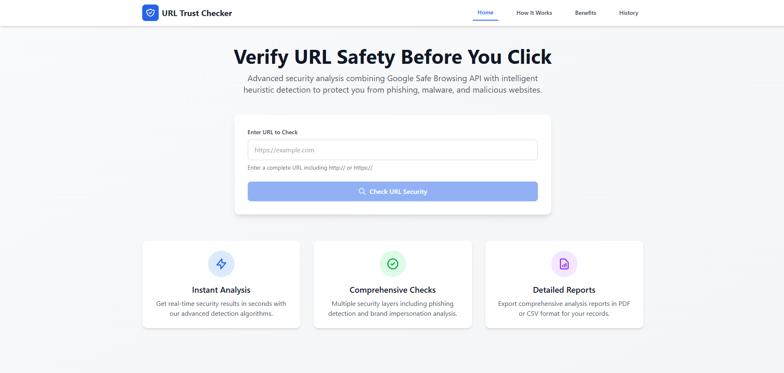
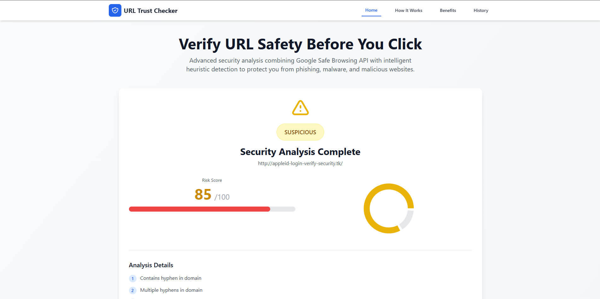
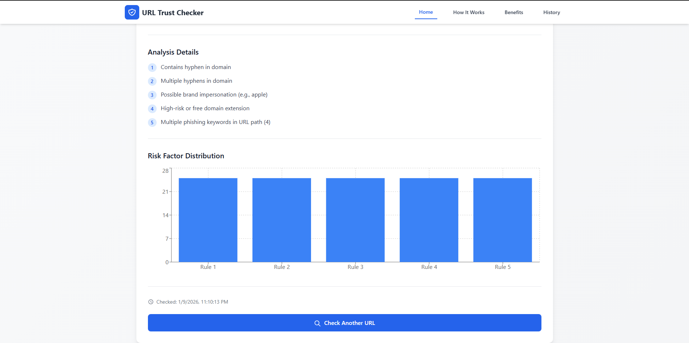
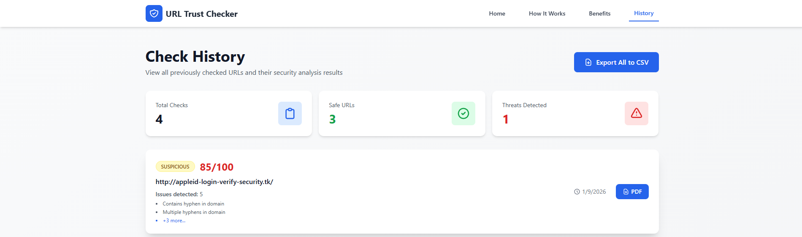

# 🛡️ ZeroPhishing – URL Trust Checker

A full-featured, production-ready React web application that analyzes URLs for security threats using Google Safe Browsing API and advanced heuristic analysis.  Features a modern, responsive interface with real-time analysis and detailed reporting.


---

## 👀 Screenshots

### Home Screen
The main interface where users can input URLs for security analysis.



### Detection Results
Real-time analysis results with verdict and detailed risk assessment.

| Detection Overview | Detailed Analysis |
|---|---|
|  |  |

### How It Works
Learn about the analysis methodology and security checks performed.


### Benefits
Discover the advantages of using ZeroPhishing for URL security. 


### History
View previously checked URLs and their analysis results.



---

## ✨ Features

### Frontend (React + Tailwind CSS)
- Modern React architecture with React Router
- Fully responsive, mobile-first design
- Professional UI with smooth transitions
- Interactive visualizations (Recharts)
- Pages: Home, How It Works, Benefits, History
- Real-time results with color-coded verdicts
- Risk score visualization (0–100)
- Report downloads (PDF/CSV)

### Backend (Node.js + Express + MongoDB)
- Google Safe Browsing integration
- Advanced heuristic analysis (9 detection rules, 0–100 scoring)
- Smart MongoDB caching
- RESTful, documented endpoints
- PDF report generation (PDFKit)
- CSV export
- Robust error handling

### Security Analysis
- Risk Score 0–100 with clear verdicts: 
  - Safe (0–29)
  - Suspicious (30–69)
  - Phishing (70–100)
- Detection rules include:
  - Long URLs, `@` symbol, IP usage, excessive subdirectories, domain hyphens, brand impersonation, suspicious numbers, unusual TLDs, phishing keywords

---

## 🏗️ Architecture Overview

High-level flow: 

1. Client (React) sends URL to backend (`/api/check`)
2. Backend queries Google Safe Browsing
3. Heuristic engine computes risk score
4. MongoDB caches results
5. Backend returns verdict, reasons, and score
6. Client displays visualization and allows PDF/CSV export

---

## 🚀 Quick Start

### Prerequisites
1. Node.js (v14+) – [Download](https://nodejs.org/)
2. MongoDB (v4.4+) – [Install Guide](https://docs.mongodb.com/manual/installation/)
3. Google Safe Browsing API Key – [Get Key](https://developers.google.com/safe-browsing/v4/get-started)

### Installation

Clone the repo: 
```bash
git clone https://github.com/b1l4l-sec/ZeroPhishing. git
cd ZeroPhishing
```

Install backend: 
```bash
cd backend
npm install
# optional: additional libraries (if not already present)
npm install pdfkit json2csv fs-extra
cp .env.example . env
```

Edit `.env`:
```env
PORT=5000
MONGO_URI=mongodb://localhost:27017/urlchecker
GOOGLE_API_KEY=your_actual_api_key_here
```

Install frontend:
```bash
cd ../client
npm install
```

### Running

Start MongoDB (example for macOS with Homebrew):
```bash
brew tap mongodb/brew
brew install mongodb-community
brew services start mongodb-community
```

Start backend:
```bash
cd ../backend
npm run dev
# or
npm start
# Server will run at http://localhost:5000
```

Start frontend:
```bash
cd ../client
npm run dev
# App will run at http://localhost:5173 (default Vite dev port)
```

---

## 📄 API Overview

Health Check
```http
GET /api/health
```
Example response:
```json
{
  "status": "OK",
  "timestamp": "2025-10-31T12:00:00.000Z",
  "mongodb": "connected"
}
```

Check URL
```http
POST /api/check
Content-Type: application/json

{
  "url": "https://example.com"
}
```
Example response:
```json
{
  "url": "https://example.com",
  "verdict": "safe",
  "score": 0. 0,
  "reasons": ["No suspicious patterns detected"],
  "checkedAt": "2025-10-31T12:00:00.000Z",
  "cached": false
}
```

---

## 🧭 Project Structure

```
ZeroPhishing/
├─ backend/
│  ├─ src/
│  ├─ package.json
│  └─ . env
├─ client/
│  ├─ src/
│  └─ package.json
├─ HomeScreen.png
├─ DetectionScreen.png
├─ MoreDetectionScreen.png
├─ HistoryScreen.png
├─ HowScreen.png
├─ BenefitsScreen.png
└─ README.md
```

---

## 🤝 Contributing

- Fork the repo and create a feature branch
- Submit a Pull Request with a clear description and visuals

---

## 📜 License

This project is licensed under the MIT License.  See `LICENSE` for details.

---
